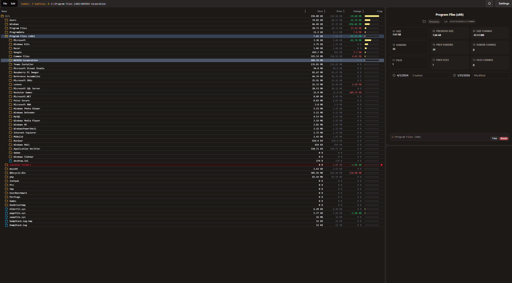

# Delta

A disk space analyzer that allows a more streamlined view of a computer's disks with the capability to compare current scans to previous saved scans for size comparisons.



## Features

- **Scan Comparisons:** Save snapshots of your disk state and compare current scans to previous ones. Allows user to identify which folders have grown in size.
- **Local & Private:** Runs 100% offline. No telemetry, no cloud uploads.
- **Lightweight:** Built with Rust and Tauri for a lightweight install and run footprint.

## Downloads & Install

### Through Release

1. Visit **[Releases Page](https://github.com/chuunibian/delta/releases)**
2. Download latest `.msi` or `.exe` file.
3. Run the installer

### Build From Source

1. Have **Rust** and **Node.js** installed.
2. Clone repo:
   ```bash
   git clone [https://github.com/chuunibian/delta.git](https://github.com/chuunibian/delta.git)
   cd delta
   ```
3. Install deps and run:
   ```bash
   npm install
   npm run tauri build
   ```

## Tech stack

- **Core:** [Tauri](https://tauri.app/) (Rust)
- **Frontend:** React + Vite
- **Persistent Storage:** SQLite

## Contributing & Feedback

This project was built out of curiousity to learn and apply rust in a utility project. I find disk space analyzers useful for when my drives are running low on space or just investigating available space flucuations, but I felt without the ability to compare to previous scans, it takes much longer to find big changes. This application is fully self-contained. It requires no internet connection to function and does not send any telemetry or usage data to external servers. The project is open source and will stay so.

## License

MIT License - see [LICENSE](LICENSE) for details.
